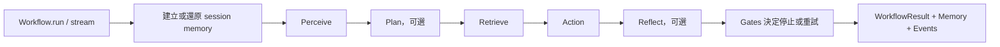

# R300-AI Agentic-SDK 模組反向工程與 Bug 測試報告

## 1. 結論摘要

本次測試的被測物是 [R300-AI/Agentic-SDK](https://github.com/R300-AI/Agentic-SDK)，不是目前的 FMEA 專案。分析固定在以下版本，避免上游更新後無法重現：

- Commit：`b16ac38a48d57c2cc633d3c75610c484b13659ff`
- 套件版本：`agentic-sdk==0.1.0`
- Python：`3.12.7`
- 測試日期：`2026-08-07`
- 外部服務：完全未使用
- API key：完全未使用；所有 LLM 行為均由本機 fake client 或自訂 module 取代

結果如下：

| 類型 | 結果 |
| --- | --- |
| 上游核心測試基準 | `56 passed` |
| 新增離線回歸測試 | `6 failed`，六項均穩定重現 |
| 額外檔案碰撞測試 | `1` 項穩定重現 |
| 確認的缺陷 | 共 `7` 項：高風險 4、中風險 2、低風險 1 |

最需要優先處理的是記憶與 session：

1. 傳入 `InContextMemory()` instance 時，不同 session 會看到彼此對話。
2. 連續兩輪回答文字相同時，第二輪 assistant turn 不會被記錄。
3. `TextPerceive` 搭配 persistent memory 時，同一則 user message 會出現兩次。
4. 同一個 `Workflow` 的同 session 併行執行會遺失其中一輪歷史。

## 2. SDK 架構逆向結果

核心執行路徑如下：



### 2.1 核心物件

| 模組 | 職責 | 關鍵狀態／輸出 |
| --- | --- | --- |
| `Workflow` | 模組路由、session memory、事件、終止條件 | `WorkflowResult` |
| `WorkflowState` | 單次執行中的 entities、entries、附件與 module 狀態 | `payload`、`last_action_result` |
| `Gates` | 限制 hop、重訪次數與總執行時間 | `WorkflowAborted` |
| `InContextMemory` | 保存一個對話的順序 turn | OpenAI messages、transcript |
| `InMemoryStore` | 同時實作 conversation memory 與可搜尋的 persistent memory | turns、search results |
| `openai_compatible` | OpenAI-compatible JSON、stream、tool call 組裝 | `OpenAIChatResponse` |

### 2.2 五種 workflow module

| 階段 | 實作 | 主要行為 |
| --- | --- | --- |
| Perceive | `PassThroughPerceive`、`TextPerceive`、`TextImagePerceive` | 整理輸入、意圖與圖片資訊 |
| Plan | `NextStepPlan` | 選擇 `retrieve` 或 `action` |
| Retrieve | `KeywordRetrieve`、`PassThroughRetrieve`、`SemanticRetrieve` | 關鍵字、FAISS、persistent memory 檢索 |
| Action | `DirectAnswerAction`、`GenerativeAction`、`ToolCallAction` | 產生最終文字或 tool calls |
| Reflect | `EvidenceCheckReflect`、`ResponseCheckReflect` | 驗證證據或回答品質，必要時回到 plan |

### 2.3 重要控制流細節

- `Workflow` 預設一定建立 `perceive -> retrieve -> action`。
- 有 `plan` 時，perceive 的 `retrieve`／空路由會先改走 plan。
- 有 `reflect` 時，action 的空路由會自動改走 reflect。
- `Workflow.stream()` 在背景 thread 呼叫同一個 `Workflow.run()`。
- 同一個 `Workflow` instance 內用 `_session_memories` 保存 session，但目前沒有 lock 或原子合併。
- `InMemoryStore` 同時保存 `conversation_turn` 與一般 `MemoryEntry`；產生 conversation 時只看 `role`，沒有檢查 `entry_type`。

## 3. 測試方法與基準

### 3.1 隔離與無金鑰原則

- SDK checkout 放在 `.research/Agentic-SDK`，不修改 FMEA 專案業務邏輯。
- 清空 `OPENAI_API_KEY`、Azure 與 AI Hub 相關環境變數。
- 新增測試只使用：
  - 自訂 deterministic Action；
  - Python `Barrier` 與 `ThreadPoolExecutor`；
  - `SimpleNamespace` 組成的 fake streaming client；
  - 本機檔案。
- 沒有 HTTP request、LLM request、Key Vault 或 embeddings API request。

### 3.2 上游核心基準

執行命令：

```powershell
cd C:\alex_project\fmea_sdk\.research\Agentic-SDK
.\.uv-venv\Scripts\python.exe -m pytest -c pyproject.toml -q `
  tests\test_events_schema.py `
  tests\test_gateway_bootstrap.py `
  tests\test_in_context_memory.py `
  tests\test_integration_documented_workflows.py `
  tests\test_memory_attachments.py `
  tests\test_release_hygiene.py `
  tests\test_smoke_readme_workflows.py `
  tests\test_token_delta_streaming.py `
  tests\test_workflow_canonical_config.py `
  tests\test_workflow_failure_contract.py
```

結果：

```text
56 passed in 3.83s
```

完整上游 suite 曾得到 `239 passed, 4 failed, 16 errors`；其餘失敗全部是受限 Windows sandbox 無法寫入 Python/pytest 暫存目錄，不是 SDK 行為缺陷，因此沒有列入本報告。

### 3.3 新增回歸測試

測試檔：`.research/Agentic-SDK/research_tests/test_core_module_regressions.py`

執行命令：

```powershell
cd C:\alex_project\fmea_sdk\.research\Agentic-SDK
.\.uv-venv\Scripts\python.exe -m pytest -c pyproject.toml `
  -p no:cacheprovider -q `
  research_tests\test_core_module_regressions.py
```

實際結果：

```text
FFFFFF
6 failed in 2.06s
```

這些測試故意描述「修正後應成立的契約」，所以在目前版本失敗即代表成功重現缺陷。

## 4. Bug 總表

| ID | 嚴重度 | 模組 | 結果 |
| --- | --- | --- | --- |
| BUG-01 | 高 | `Workflow` / `InContextMemory` | memory instance 跨 session 洩漏 |
| BUG-02 | 高 | `Workflow` / memory | 相同回答造成 assistant turn 漏記 |
| BUG-03 | 高 | `TextPerceive` / `InMemoryStore` | persistent conversation 重複 user turn |
| BUG-04 | 高 | `Workflow` concurrency | 同 session 併行更新互相覆蓋 |
| BUG-05 | 中 | `openai_compatible.chat_stream` | 空 chunk 可繞過 idle timeout |
| BUG-06 | 低 | `InMemoryStore.search` | 負數 `top_k` 變成 Python 負 slice |
| BUG-07 | 中 | `FaissKnowledgeBase` | 同名來源檔在保存時互相覆蓋 |

## 5. 詳細 Bug 與重現方式

### 5.0 先看懂幾個名詞

以下 Bug 說明會反覆用到這些詞：

| 名詞 | 白話意思 |
| --- | --- |
| session | 一段獨立對話。使用者 A 與使用者 B 應是不同 session。 |
| turn | 對話中的一則訊息，例如一則 user 問題或 assistant 回答。 |
| memory instance | 已經建立好的記憶物件，例如 `memory = InContextMemory()`；它是一個會持續保存資料的實體，不只是型別名稱。 |
| persistent memory | 除了組成對話，也可以被 Retrieve 搜尋的長期記憶。 |
| snapshot | 某一時間點的記憶副本，像是先把文件影印一份再各自修改。 |
| lost update | 兩個執行同時修改資料，後存檔的人把先存檔者的內容蓋掉。 |
| stream chunk | 模型串流回傳的一小段資料；可能有文字，也可能只是空白 keepalive。 |
| `top_k` | 最多要取回幾筆搜尋結果。 |

每段程式碼中的「簡化後邏輯」是為了說明問題而寫的等價示意，不是逐字複製上游原始碼。

### BUG-01：`memory_type=InContextMemory()` 會跨 session 洩漏對話

嚴重度：高。這是 session 隔離與資料隱私問題。

**一句話白話版：** 使用者 A 講過的內容，可能在使用者 B 的新對話裡一起被送給模型。

**生活化例子：** 想像客服系統只有一本共用筆記本。A 客戶談完訂單後，系統只把封面上的客戶姓名改成 B，卻沒有換一本新筆記本。B 開始對話時，裡面仍然留著 A 的資料。

文件說明 `InContextMemory` 保存同一個 `session_id` 的對話，也明確示範 `Workflow(memory_type=memory)`。但傳入 memory instance 時，`_resolve_memory()` 每次都重用同一個 object，只改寫其 `workflow_id` 與 `session_id`，既有 turns 不會被清除或過濾。

**程式怎麼走：**

```python
# 簡化後邏輯
memory = InContextMemory()                 # 只有一個實體
workflow = Workflow(memory_type=memory)

workflow.run("A 的秘密", session_id="A")  # 寫進同一個 memory
workflow.run("B 的問題", session_id="B")  # 仍拿同一個 memory，只把 session_id 改成 B
```

問題不在於 `session_id` 沒有傳入，而是 SDK 對既有 instance 採用這種概念：

```python
# 目前行為的簡化示意
resolved = memory_type       # 直接拿回原物件
resolved.session_id = "B"   # 只換標籤
return resolved              # A 的 turns 還在裡面
```

正確概念應該是每個 session 各拿一份記憶：

```python
session_memories = {
    "A": memory_for_a,
    "B": memory_for_b,
}
```

上游根因：

- [`workflow.py` L505-L513](https://github.com/R300-AI/Agentic-SDK/blob/b16ac38a48d57c2cc633d3c75610c484b13659ff/agentic_sdk/core/workflow.py#L505-L513)：instance 被直接重用並改寫 session。
- [`in_context.py`](https://github.com/R300-AI/Agentic-SDK/blob/b16ac38a48d57c2cc633d3c75610c484b13659ff/agentic_sdk/memory/in_context.py)：讀取 turns 時不依 `turn.session_id` 過濾。

最小重現：

```python
from agentic_sdk import InContextMemory, Workflow

class EchoAction:
    name = "action"
    def __call__(self, state):
        return f"reply:{state.latest_user_message()}"

workflow = Workflow(memory_type=InContextMemory(), action=EchoAction())
workflow.run("secret-from-a", session_id="session-a")
result_b = workflow.run("hello-from-b", session_id="session-b")

print([(t.role, t.content, t.session_id) for t in result_b.memory.turns])
```

實際：session B 的 memory 包含 session A 的 user 與 assistant turns。

預期：session B 只能看到 `hello-from-b` 與其回答。

單項測試：

```powershell
python -m pytest -q research_tests/test_core_module_regressions.py::test_memory_instance_isolated_by_session
```

修正建議：

- memory instance 應綁定單一 session；新 session 必須建立獨立 memory 或使用 per-session copy。
- `InContextMemory` 在輸出 turns/messages 時增加 session scope 防線。
- 增加 A/B/A 三個 session 交錯測試。

**為什麼這樣修有效：** 第一層在 Workflow 分開保存 A、B 的物件；第二層在 Memory 輸出訊息時再次檢查 session。即使未來其中一層寫錯，另一層仍能擋住跨使用者資料。

### BUG-02：連續相同回答會漏掉第二輪 assistant turn

嚴重度：高。會破壞 conversation 的 `user -> assistant` 配對，使後續模型看到不完整歷史。

**一句話白話版：** 如果機器人連續兩次都回答「沒有資料」，SDK 會以為第二次回答已經存過，因此只記問題、不記回答。

**生活化例子：** 會議記錄員看到這次結論跟上次一樣，就把這次結論整段省略。之後看記錄的人只會看到第二個問題，卻不知道當時其實也有回答。

根因位於 [`workflow.py` L307-L310](https://github.com/R300-AI/Agentic-SDK/blob/b16ac38a48d57c2cc633d3c75610c484b13659ff/agentic_sdk/core/workflow.py#L307-L310)：只要「最新 assistant 文字」等於本輪 final message，就不 append。本判斷沒有確認最新 assistant 是否屬於本輪，因此兩輪合理地產生同一句話時會誤判為重複寫入。

**有問題的判斷可簡化成：**

```python
latest_assistant = memory.latest_assistant_turn()

if latest_assistant.content != final_message:
    memory.append_message("assistant", final_message)
```

假設兩輪都是 `same-answer`：

```text
第一輪：latest assistant = 無          → 寫入 same-answer
第二輪：latest assistant = same-answer → 因文字相同而跳過
```

真正要判斷的不是「文字是否一樣」，而是「本輪是否已經寫過 assistant turn」。相同文字可以是兩次不同且都有效的回答。

最小重現：

```python
from agentic_sdk import Workflow

class ConstantAction:
    name = "action"
    def __call__(self, state):
        return "same-answer"

workflow = Workflow(action=ConstantAction())
workflow.run("first", session_id="s")
result = workflow.run("second", session_id="s")
print([(t.role, t.content) for t in result.memory.turns])
```

實際：

```text
user:first -> assistant:same-answer -> user:second
```

預期：

```text
user:first -> assistant:same-answer -> user:second -> assistant:same-answer
```

單項測試：

```powershell
python -m pytest -q research_tests/test_core_module_regressions.py::test_equal_consecutive_answers_are_both_recorded
```

修正建議：不要用內容文字去重。每次成功 run 都應 append assistant turn；若要避免 action 自行寫入後重複，可比對本輪 `workflow_id`、turn index 或明確的 entry metadata。

**較安全的簡化寫法：**

```python
if not memory.has_assistant_turn_for_run(current_run_id):
    memory.append_message(
        "assistant",
        final_message,
        metadata={"run_id": current_run_id},
    )
```

這樣即使兩次回答文字完全相同，只要是不同 run，就會各自保留。

### BUG-03：`TextPerceive` + persistent memory 會把 user turn 記兩次

嚴重度：高。後續 Plan、Retrieve、Action 使用 `as_openai_messages()` 時會收到同一句 user input 兩次，可能改變模型判斷與 token 用量。

**一句話白話版：** 使用者只問一次「商品有貨嗎？」，模型看到的對話卻像使用者連續問了兩次。

這裡有兩種資料原本用途不同：

- `conversation_turn`：用來還原 user/assistant 對話順序。
- `user_input` memory entry：用來保存可搜尋的意圖、重要性與 metadata。

問題是第二種資料也被標成 `role="user"`，而 `InMemoryStore` 組成對話時，只看 role，不看 entry type。

執行順序：

1. `Workflow.run()` 先用 `append_message("user", ...)` 寫入 `conversation_turn`。
2. `TextPerceive` 又寫入一個 `entry_type="user_input"`、`role="user"` 的 `MemoryEntry`。
3. `InMemoryStore._conversation_turns()` 只看 `role`，未限制 `entry_type == "conversation_turn"`。
4. 同一文字因此變成兩個 conversation user turns。

**程式怎麼走：**

```python
# 第一次：Workflow.run() 寫入真正的對話 turn
store.append(
    MemoryEntry(entry_type="conversation_turn", role="user", content="hello")
)

# 第二次：TextPerceive 寫入供長期搜尋使用的資料
store.append(
    MemoryEntry(entry_type="user_input", role="user", content="hello")
)

# 目前組對話的條件只檢查 role，所以兩筆都被選中
conversation = [entry for entry in store if entry.role in allowed_roles]
```

最後送給後續模組的訊息近似：

```python
[
    {"role": "user", "content": "hello"},
    {"role": "user", "content": "hello"},
]
```

這不只是畫面上多顯示一次；Plan 或 Action 模型也真的可能收到重複 prompt。

相關原始碼：

- [`text.py` L109-L124](https://github.com/R300-AI/Agentic-SDK/blob/b16ac38a48d57c2cc633d3c75610c484b13659ff/agentic_sdk/modules/perceive/text.py#L109-L124)
- [`in_memory.py` conversation filter](https://github.com/R300-AI/Agentic-SDK/blob/b16ac38a48d57c2cc633d3c75610c484b13659ff/agentic_sdk/memory/in_memory.py)

重現使用本機 fake JSON stream，不需要 API key：

```powershell
python -m pytest -q research_tests/test_core_module_regressions.py::test_text_perceive_does_not_duplicate_persistent_conversation_turn
```

實際 roles：

```text
["user", "user", "assistant"]
```

預期 roles：

```text
["user", "assistant"]
```

修正建議（二選一）：

- `TextPerceive` 寫入供搜尋使用的 `user_input` 時不要設定 conversation `role`；或
- `InMemoryStore._conversation_turns()` 只納入 `entry_type="conversation_turn"`。

第二種較安全，能避免其他一般 memory entries 因恰好有 role 而汙染 prompt。

**為什麼第二種較安全：** `entry_type` 是資料用途，`role` 只是資料內容的角色。用 `entry_type="conversation_turn"` 當作對話入口，可以避免搜尋索引、摘要或稽核資料誤混入對話。

### BUG-04：同 session 併行執行會 lost update

嚴重度：高。`Workflow.stream()` 本身會建立背景 thread，因此同一個 Workflow 被多個 request／stream 共用是合理情境。

**一句話白話版：** 同一段對話同時送出兩個問題時，其中一個問題與回答可能整組消失。

**生活化例子：** 甲、乙同時拿到同一份文件影本。甲加入一行後存檔，乙也加入一行後存檔；乙是最後存的人，因此檔案只剩乙的修改，甲的修改被覆蓋。

根因：

- 每個 run 可同時從 `_session_memories[session_id]` 複製同一份舊 snapshot。
- 兩個 run 各自在自己的 copy 追加資料。
- 結束時直接 assignment 回 `_session_memories[session_id]`。
- 最後完成者覆蓋先完成者，沒有 lock、版本檢查或 merge。

**兩個 thread 的時間順序：**

```text
Thread A：讀取空 memory ── 加入 first  ── 存回 [first, reply:first]
Thread B：讀取空 memory ── 加入 second ───────── 存回 [second, reply:second]
                                                   ↑ 覆蓋 A
```

對應的簡化程式：

```python
# A 與 B 幾乎同時做這件事
local_memory = session_memories[session_id].copy()
local_memory.append(current_turn)

# 沒有 lock；最後 assignment 的人獲勝
session_memories[session_id] = local_memory
```

`dict` 的單次 assignment 在 Python 中即使不會寫壞記憶體，也不代表這整段「讀取、修改、寫回」是原子的。

相關原始碼：

- [`workflow.py` L507-L510](https://github.com/R300-AI/Agentic-SDK/blob/b16ac38a48d57c2cc633d3c75610c484b13659ff/agentic_sdk/core/workflow.py#L507-L510)
- [`workflow.py` L311-L316](https://github.com/R300-AI/Agentic-SDK/blob/b16ac38a48d57c2cc633d3c75610c484b13659ff/agentic_sdk/core/workflow.py#L311-L316)

回歸測試以 `Barrier(2)` 強制兩個 run 同時持有舊 snapshot：

```powershell
python -m pytest -q research_tests/test_core_module_regressions.py::test_concurrent_same_session_runs_do_not_lose_turns
```

實際：最終只剩其中一組 `user + assistant`。

預期：兩組 turns 都存在；或 SDK 明確序列化同 session 的執行。

修正建議：

- 最直接：對每個 session 使用獨立 lock，讓同 session run 串行、不同 session 仍可併行。
- 若要真正平行：為 memory snapshot 加版本，結束時執行 compare-and-merge，並以 turn ID 去重。
- `_session_memories` 與公開的 `workflow.memory` 都要在相同同步策略下更新。

**為什麼 per-session lock 合理：** 只有相同 session 需要排隊。使用者 A 與 B 的不同 session 仍可同時執行，不會把整個服務鎖成單線程。

### BUG-05：空白／keepalive stream chunk 可繞過 idle timeout

嚴重度：中。可能讓 worker 或 streaming request 永久掛住。

**一句話白話版：** SDK 說「太久沒收到有效內容就超時」，但只要服務一直送空包裹，計時檢查就永遠不會執行。

stream provider 有時會送沒有文字的 chunk，作為連線維持、角色資訊或其他 metadata。空 chunk 本身不一定是錯誤，錯的是 SDK 在檢查時間之前就跳過它。

在 [`openai_compatible.py` L342-L349](https://github.com/R300-AI/Agentic-SDK/blob/b16ac38a48d57c2cc633d3c75610c484b13659ff/agentic_sdk/llm/openai_compatible.py#L342-L349) 中，程式先對「沒有 content、沒有 tool delta」的 chunk 執行 `continue`，之後才檢查 elapsed time。因此 provider 持續送空 chunk 時永遠不會觸發 `idle_timeout_sec`。

**目前順序的簡化示意：**

```python
for chunk in stream:
    if chunk 沒有文字也沒有 tool call:
        continue                    # 已跳到下一輪

    if 現在時間 - 上次有效內容時間 > timeout:
        raise TimeoutError          # 空 chunk 永遠走不到這裡
```

**應調整成：**

```python
for chunk in stream:
    if 現在時間 - 上次有效內容時間 > timeout:
        raise TimeoutError

    if chunk 沒有文字也沒有 tool call:
        continue

    上次有效內容時間 = 現在時間
```

注意：這只能處理「provider 持續送空 chunk」。如果 provider 卡死、連空 chunk 都沒有送，程式會阻塞在等待下一個 chunk，還是需要底層 read timeout 或 watchdog。

此外，如果 iterator 本身卡在等待下一個 chunk，單純在 `for chunk in stream` 內比較時間也無法中斷阻塞。

單項重現：

```powershell
python -m pytest -q research_tests/test_core_module_regressions.py::test_stream_idle_timeout_counts_empty_provider_chunks
```

測試把 monotonic time 模擬成 `0s -> 10s -> 20s -> 30s`，並設定 `idle_timeout_sec=1`。實際沒有丟出 `TimeoutError`。

修正建議：

- 每個收到的 chunk 都要先檢查 idle gap，再判斷是否有內容。
- 若 timeout 定義是「多久沒有 meaningful token」，空 chunk 不應更新 `last_token_at`，但仍必須做超時計算。
- 真正阻塞的 iterator 需要 provider timeout、watchdog thread 或可取消的非同步讀取，不能只靠迴圈內判斷。

### BUG-06：負數 `top_k` 會回傳「除了最後一筆以外」的資料

嚴重度：低，但結果非常反直覺，且可造成資料量超出呼叫端預期。

**一句話白話版：** 呼叫端不小心傳 `top_k=-1`，SDK 不但沒有報錯，還可能把幾乎全部記憶都取回來。

`InMemoryStore.search()` 直接使用 `results[:top_k]`。Python 的 `[:-1]` 代表排除最後一筆，不代表零筆或錯誤。

**Python slice 的意思：**

```python
results = ["one", "two", "three"]

results[:2]   # ["one", "two"]，符合 top_k=2
results[:0]   # []
results[:-1]  # ["one", "two"]，意思是「拿到倒數第一筆之前」
```

所以 `top_k=-1` 會被 Python 當成陣列位置，而不是「無效的最大筆數」。若資料有一萬筆，可能意外回傳 9,999 筆。

重現：

```python
from agentic_sdk import InMemoryStore, MemoryEntry

store = InMemoryStore(workflow_name="wf")
for text in ["one", "two", "three"]:
    store.append(MemoryEntry(content=text, workflow_name="wf"))

print([r.entry.content for r in store.search("wf", top_k=-1)])
```

實際：

```text
["one", "two"]
```

另有不一致：`FaissKnowledgeBase.search()` 會把 `top_k <= 0` 強制成 `1`；相同概念的兩個 memory/retrieval 實作行為不同。

單項測試：

```powershell
python -m pytest -q research_tests/test_core_module_regressions.py::test_negative_top_k_is_rejected_instead_of_python_negative_slice
```

修正建議：在公開入口統一驗證 `top_k` 是正整數；若允許 `0`，需明確回傳空 list。負數應 `raise ValueError`。

**建議驗證：**

```python
if isinstance(top_k, bool) or not isinstance(top_k, int) or top_k < 0:
    raise ValueError("top_k must be a non-negative integer")
if top_k == 0:
    return []
```

另外要特別排除 `bool`，因為 Python 中 `bool` 是 `int` 的子類別，`True` 可能被當成 `1`。

### BUG-07：不同來源的同名檔案在 semantic saved path 互相覆蓋

嚴重度：中。會造成知識來源遺失，且索引可能只包含最後被保存的版本。

**一句話白話版：** 兩個資料夾各有一個 `index.md`，SDK 搬到知識庫時把兩個都存成同一路徑，後來的檔案會蓋掉前面的檔案。

例如原始來源是：

```text
docs/modules/index.md    → 模組文件
docs/tutorials/index.md  → 教學文件
```

目前保存規則只取檔名：

```python
saved_path / source_path.name
```

因此兩個來源都變成：

```text
saved/index.md
```

當 `sources` 包含兩個不同資料夾下的同名檔案時，兩者都被映射成：

```python
target_path = self._saved_source_root / source_path.name
```

根因位於 [`semantic.py` L206-L209](https://github.com/R300-AI/Agentic-SDK/blob/b16ac38a48d57c2cc633d3c75610c484b13659ff/agentic_sdk/modules/retrieve/semantic.py#L206-L209)。

不需要 embeddings 或 API 的重現：

```powershell
cd C:\alex_project\fmea_sdk\.research\Agentic-SDK
.\.uv-venv\Scripts\python.exe -c "from agentic_sdk.modules.retrieve.semantic import FaissKnowledgeBase; E=type('E',(),{'embed':lambda self,text:[1.0]}); kb=FaissKnowledgeBase(index_path='.collision/index',embedder=E(),source_paths=['docs/modules/index.md','docs/tutorials/index.md'],saved_source_path='.collision/saved'); print(kb._source_paths); print(len(set(kb._source_paths)))"
```

實際：

```text
['.collision\\saved\\index.md', '.collision\\saved\\index.md']
1
```

兩個來源最後只剩一個唯一保存路徑。

修正建議：

- 保存時保留來源相對路徑；或
- 目標檔名加入來源 path hash；或
- 發現 collision 時明確拒絕並列出衝突來源。

索引 metadata 應保留 original path 與 saved path，方便追蹤。

**保留相對路徑後的理想結果：**

```text
saved/docs/modules/index.md
saved/docs/tutorials/index.md
```

如果來源不具共同根目錄，也可以使用短 hash：

```text
saved/index-a13f9c.md
saved/index-72be10.md
```

## 6. 建議增加的完整測試情境

下表可作為下一輪 SDK regression suite。`已執行` 代表本次已有動態證據。

| 區域 | 情境 | 期待結果 | 狀態 |
| --- | --- | --- | --- |
| Memory | memory instance 在 session A/B 間隔離 | B 不含 A 的 turns | 已執行，失敗 |
| Memory | 同一回答連續出現兩次 | 每輪都有 assistant turn | 已執行，失敗 |
| Memory | persistent + `TextPerceive` | user turn 只出現一次 | 已執行，失敗 |
| Memory | 同 session 兩個 concurrent run | 不遺失任何 turn | 已執行，失敗 |
| Memory | 不同 session concurrent run | 各自保存且不互相阻塞 | 建議 |
| Memory | 回傳 memory 後由呼叫端修改 | 不回寫 SDK 內部 snapshot | 建議 |
| Memory search | `top_k` 為 `0`、負數、float、bool | 統一驗證與錯誤型別 | 部分執行，失敗 |
| Memory search | embedding 維度不同、全零、NaN | 明確拒絕或安全降級 | 建議 |
| Workflow | `max_node_hops` 邊界值 0/1/N | 無 off-by-one | 建議 |
| Workflow | `max_revisit` 的首次與第 N+1 次 | 計數與 abort event 一致 | 建議 |
| Workflow | module 回傳 `None`、list、錯誤 payload | 非 Action 要明確 TypeError | 建議 |
| Workflow | module 指向不存在的 next module | controlled aborted result | 建議 |
| Workflow | event callback 丟出例外 | 定義是否中止 workflow | 建議 |
| Stream | 只有空 chunk | 觸發 idle timeout | 已執行，失敗 |
| Stream | iterator 完全阻塞 | watchdog 可取消 | 建議 |
| Stream | 部分 token 後 provider error | 已送 token、result/error 契約一致 | 建議 |
| Stream | 消費者提前停止 iterator | thread/stream 可關閉，不洩漏 | 建議 |
| JSON parser | chunk 切在 escape、Unicode、數字中間 | 欄位只發送一次且值完整 | 上游已有部分 |
| JSON parser | JSON 前有損壞 `{...` 再接合法 JSON | parser 可重新同步 | 建議 |
| JSON parser | duplicate key | field event 與 final JSON 一致 | 建議 |
| Tool call | 多個 call 交錯、index 順序不同 | id/name/arguments 不串錯 | 建議 |
| Tool call | arguments 是空字串或破碎 JSON | 保留原始值並交由呼叫端驗證 | 建議 |
| Tool call | provider 未提供 index | 不應把不同 call 誤合併 | 建議 |
| Semantic | 兩個不同目錄有同名來源 | 兩份來源都保存 | 已執行，失敗 |
| Semantic | FAISS index 與 metadata 數量不一致 | 明確報 corrupt index | 建議 |
| Semantic | 文件 embedding 維度不一致 | 建索引前驗證並指出檔案 | 建議 |
| Semantic | source 更新但 mtime 相同 | 能以 hash 或 size 判斷 stale | 建議 |
| Attachment | bytes、data URL、HTTP URL | 支援格式一致 | 上游已有部分 |
| Attachment | 超大 bytes、錯誤 media type | 明確限制，不建立巨大 prompt | 建議 |
| Reflect | response checker provider outage | 明確選擇 fail-open 或 fail-closed | 建議 |
| Config | 空白 entry、未知 module、負 Gates | 建構時及早拒絕 | 建議 |

## 7. 建議修復優先順序

1. 先修 BUG-01、BUG-03：避免跨 session 洩漏與 prompt 重複。
2. 再修 BUG-04：建立 per-session concurrency policy。
3. 修 BUG-02：改成每輪以 run identity 判斷是否已寫入 assistant。
4. 修 BUG-05：讓 timeout 對空 chunk 與阻塞 iterator 都有效。
5. 修 BUG-07：保存 semantic source 時保留唯一性。
6. 統一 `top_k`、Gates 與 config 的輸入驗證。

每項修復都應先保留本次新增 regression test，修正後預期從 `6 failed` 變成 `6 passed`，再執行上游完整測試。

## 8. 安裝觀察（不列為核心 module bug）

在 `uv pip install -e . pytest` 下，`markitdown[all]==0.1.7` 間接需要 prerelease `azure-ai-contentunderstanding>=1.2.0b1`，uv 預設解析會失敗；加入以下選項才能完成：

```powershell
uv pip install --prerelease=allow -e . pytest
```

這可能是 packaging compatibility 問題，但不屬於本次要求的 module 行為，因此沒有計入七項 bug。建議 CI 額外加入乾淨環境的 `pip` 與 `uv` 安裝 smoke test。

## 9. 可交付檔案

- 本報告：`AGENTIC_SDK_REVERSE_ENGINEERING_BUG_REPORT.md`
- 離線回歸測試：`.research/Agentic-SDK/research_tests/test_core_module_regressions.py`
- 被測 SDK checkout：`.research/Agentic-SDK`
