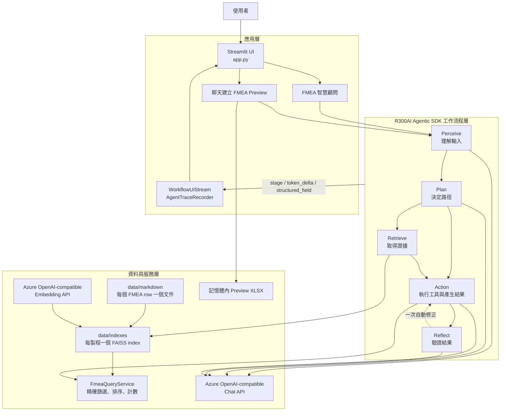
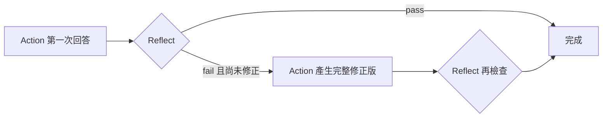
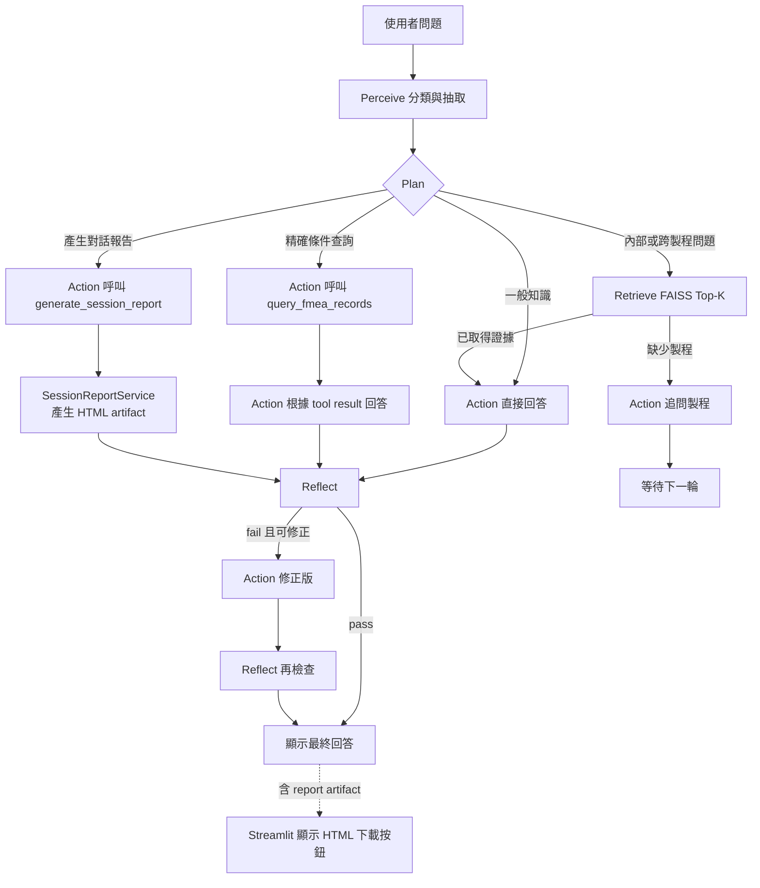
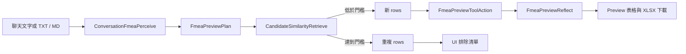
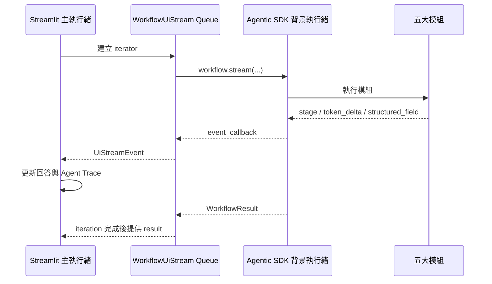
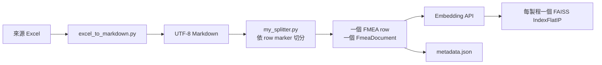

# FMEA R300AI Agentic SDK 智慧顧問

本專案是一套以 **R300AI Agentic SDK** 為流程核心、**FAISS** 為 FMEA 向量知識庫、**Azure OpenAI-compatible API** 為語言模型與 Embedding 服務、**Streamlit** 為操作介面的 FMEA 應用。

系統目前提供三個主要功能：

1. **FMEA 智慧顧問**：理解使用者問題，自動判斷是否需要語意檢索或精確查詢，產生答案後再做品質檢查與一次自動修正。
2. **從聊天建立 FMEA**：將會議、客服或工程聊天紀錄整理成候選 FMEA rows，與現有資料比對去重，再輸出可下載的 Preview Excel；此流程不會直接修改正式知識庫。
3. **PVD 模擬機台**：將 PVD row 內預先核准的三個數值 setpoint 套用到 Streamlit 內的 demo 狀態；此功能只用於展示 workflow 工具呼叫，不會控制實體機台。

> 名詞說明：R300AI Agentic SDK 的五個標準模組是 **Perceive、Plan、Retrieve、Action、Reflect**。常見的 `Percieve` 與 `Receive` 分別應寫成 `Perceive` 與 `Retrieve`。

---

## 1. 系統架構總覽



### 分層責任

| 層級 | 主要元件 | 責任 |
| --- | --- | --- |
| UI 層 | `app.py` | 頁面、對話輸入、上傳、狀態顯示、表格與下載 |
| UI 橋接層 | `src/ui_stream.py`、`src/agent_trace.py` | 將 SDK 背景執行事件轉成可由 Streamlit 主執行緒安全呈現的事件與軌跡 |
| Agent 工作流程層 | `src/workflow.py`、`src/fmea_preview.py` | 組裝五大模組、定義路由、事件欄位與流程邊界 |
| 領域模組層 | `process_retrieve.py`、`tool_action.py`、`fmea_reflect.py` | 製程檢索、工具呼叫、回答驗證與自動修正 |
| 查詢與工具層 | `fmea_tools.py`、`fmea_query.py` | Allow-list 工具、數值篩選、排序、計數與回傳上限 |
| 知識庫層 | `my_splitter.py`、`faiss_knowledge_base.py` | Markdown 切分、Embedding、索引持久化與語意搜尋 |
| 資料準備層 | `excel_to_markdown.py`、`build_indexes.py` | Excel 轉標準 Markdown、建立或更新 FAISS indexes |
| 設定層 | `src/config.py`、`.env` | Chat、Embedding 與資料路徑設定 |

---

## 2. R300AI Agentic SDK 在本專案的角色

Agentic SDK 不是單純呼叫一次 LLM，而是負責：

- 將任務拆成 `Perceive → Plan → Retrieve → Action → Reflect` 模組。
- 以 `WorkflowState` 保存單次執行中的結構化狀態。
- 以 `session_id` 和預設 `InContextMemory` 承接同一對話的多輪內容。
- 由每個模組回傳的 `next_module` 決定分支與回訪路徑。
- 透過 `ModuleOutput.payload` 讓後續模組讀取前一階段結果。
- 透過 `ContextEntry` 保存 perceived、retrieved、action result、reflection 等可觀測脈絡。
- 透過 `stage`、`token_delta`、`structured_field` 事件支援 UI 串流與執行追蹤。
- 以 SDK gate 限制總節點次數、單節點回訪次數與執行時間，避免無限循環。

目前套件在 `requirements.txt` 中固定到 R300-AI/Agentic-SDK commit `c30e449d5cb781fa541311dd31203fdadeedf354`，確保部署時使用一致的 SDK 行為。

### SDK 與應用程式的邊界

| SDK 提供 | 本專案自行實作 |
| --- | --- |
| Workflow 執行器與模組路由 | FMEA 領域規則與提示詞 |
| `WorkflowState`、`ModuleOutput`、`ContextEntry` | FAISS 知識庫與製程選擇策略 |
| 多輪 In-context memory | 精確 FMEA 查詢工具與 allow-list dispatcher |
| stage、token、structured field events | Streamlit 頁面、狀態卡、表格與下載按鈕 |
| `run()` 與 `stream()` | UI 執行緒橋接與安全的 Trace 投影 |

這個邊界很重要：**Agentic SDK 提供 UI 所需的即時事件與執行資料，但不直接提供本專案的 Streamlit widgets**。畫面如何呈現，是由本專案消費 SDK events 後自行決定。

---

## 3. 五大 Agent 模組與自訂方式

所有 SDK 模組都遵循相同介面：

```python
class CustomModule:
    name = "retrieve"

    def __call__(self, state: WorkflowState) -> ModuleOutput:
        previous_value = state.lookup("some_key")
        return ModuleOutput(
            next_module="action",
            payload={"new_key": previous_value},
            context_updates=[
                ContextEntry(
                    type=ContextEntryType.RETRIEVED,
                    content="供後續模組使用或稽核的內容",
                    metadata={"count": 1},
                )
            ],
        )
```

最重要的三個概念是：

- `state.lookup(key)`：讀取前面模組寫入的 entity。
- `payload`：寫入或更新 entities，供後面模組使用。
- `next_module`：指定下一站；設為 `None` 通常表示結束，但 Action 後若有 Reflect，SDK 會自動進入 Reflect。

### 3.1 FMEA 智慧顧問的模組組合

| 階段 | 實作 | 類型 | 本專案用途 |
| --- | --- | --- | --- |
| Perceive | `TextPerceive` | SDK 內建、領域化設定 | 將問題分類成一般知識、內部 FMEA、結構化查詢或跨製程比較，並抽取製程與複雜度 |
| Plan | `NextStepPlan` | SDK 內建、領域化設定 | 決定直接進 Action，或先進 Retrieve |
| Retrieve | `ProcessAwareFmeaRetrieve` | 自訂 | 依指定製程與複雜度查詢對應 FAISS index |
| Action | `FmeaToolAction` | 自訂 | 讓模型選擇是否呼叫 allow-listed 工具，再根據證據產生最終回答 |
| Reflect | `FmeaAutoCorrectReflect` | 自訂 | 檢查答案是否有證據、數值與條件是否正確；失敗時最多回到 Action 修正一次 |

#### Perceive：把自然語言轉成結構化意圖

輸出重點如下：

```json
{
  "intent": "internal_fmea",
  "summary": "查詢 PVD 製程的晶圓破片原因",
  "details": {
    "query_type": "internal_fmea",
    "processes": ["PVD"],
    "cross_table": false,
    "complexity": "small"
  }
}
```

主要 `query_type` 包含：

| 類型 | 範例 | 後續策略 |
| --- | --- | --- |
| `general_knowledge` | 「RPN 如何計算？」 | 不查內部資料，直接回答一般 FMEA 知識 |
| `internal_fmea` | 「PVD 晶圓破片有哪些原因？」 | 先做指定製程的語意檢索 |
| `structured_fmea` | 「列出 PVD 中 RPN 大於 100 的項目」 | 由 Action 呼叫精確查詢工具 |
| `cross_table` | 「比較 PVD 與 ECD 的高風險項目」 | 對多個製程檢索並產生比較表 |
| `machine_control` | 「依相關 PVD 紀錄調整模擬機台」 | 先檢索 PVD row，再套用該 row 的 demo recipe |

若使用者詢問內部專業問題但沒有指定製程，系統不猜測也不掃描所有製程，而是先追問可查詢的製程。下一輪只要沿用相同 `session_id`，Perceive 就能結合前一輪問題與新補充的製程。

#### Plan：選擇執行路徑

Plan 只輸出簡短路由標籤與 `next_module`：

- `general_knowledge` → `action`
- `structured_fmea` → `action`
- `machine_control` → `retrieve`
- `internal_fmea` → `retrieve`
- `cross_table` → `retrieve`

結構化查詢略過語意 Retrieve，是因為門檻、範圍、排序與計數必須由 deterministic tool 精確處理，不能只依賴 Top-K 相似文件。

#### Retrieve：製程感知的語意檢索

`ProcessAwareFmeaRetrieve` 會讀取 `perceived_details`，並依複雜度設定每個製程的 Top-K：

| complexity | 每製程 Top-K |
| --- | ---: |
| `small` | 5 |
| `medium` | 8 |
| `large` | 12 |

每個 Markdown 檔代表一個製程知識庫，每個 FMEA row 是一個向量文件。檢索結果會寫入：

- `retrieved_snippet`
- `latest_retrieved_content`
- `retrieval_processes`
- `retrieval_top_k`
- `retrieval_hit_count`

若缺少製程，Retrieve 會以 `_trace_status=skipped` 標記為略過，接著讓 Action 回覆澄清問題。

#### Action：工具呼叫與回答生成

`FmeaToolAction` 採兩階段工具呼叫模式：

1. 將完整對話、Perceive 結果、Retrieve 證據與 Reflect 修正指示組成 messages。
2. 模型依意圖決定是否呼叫允許的工具，例如 `query_fmea_records` 或 `apply_machine_action`。
3. `FmeaToolDispatcher` 只執行 allow-list 中的工具。
4. 若有工具結果，再呼叫模型一次產生使用者可讀的最終回答。

`query_fmea_records` 適合：

- S / O / D / RPN 最小值或最大值。
- 依風險或 Excel row 排序。
- 精確 document ID。
- 文字包含條件。
- 符合筆數與是否超過回傳上限。

工具會掃描選定製程的完整 metadata，因此 `total_matches` 是精確值；為限制模型上下文，最多只回傳前 20 筆，並以 `has_more` 告知是否仍有資料。

#### Reflect：品質檢查與有界自動修正

`FmeaAutoCorrectReflect` 檢查：

- 是否直接回答問題並涵蓋必要條件。
- 內部 FMEA 事實是否有 retrieved context 或 tool results 支持。
- 是否捏造失效模式、原因、措施或風險數字。
- 門檻、排序、計數與 `has_more` 是否正確。
- 資料不足時是否清楚說明。

流程如下：



目前 `max_corrections=1`，因此最多只會自動修正一次，避免 Agent 在 Action 與 Reflect 間無限循環。若 Reflect 服務暫時不可用，但 Action 已有正常答案，系統會保留答案，不會因驗證器故障製造重試迴圈。

#### PVD 模擬機台 Demo

PVD Excel 可在最後加入可選的 `machine_action` 欄位；每個 row 以穩定的 document ID（例如 `PVD-0001`）對應一組完整 recipe：

```json
{
  "machine_id": "PVD-DEMO-01",
  "setpoints": {
    "button_1": 10,
    "button_2": 20,
    "button_3": 30
  }
}
```

`button_1`、`button_2`、`button_3` 都是 `0` 到 `100` 的數值 setpoint。當 Perceive 判定使用者明確要求執行並輸出 `machine_control` 時，workflow 先 Retrieve，再讓 Action 呼叫 `apply_machine_action(document_id)`；工具後端從該 row 讀取 recipe，模型不能自行傳入或改寫 setpoint。明確指令會直接執行、不再二次確認，但仍有以下限制：

- dispatcher allow-list 只接受已登錄的工具與參數。
- `document_id` 必須是本輪實際檢索到、具有合法 `machine_action` 的 PVD row。
- `workflow_id + document_id` 形成冪等保護，避免 Reflect 重試造成重複執行。

執行前後狀態與歷程可在 Streamlit 第三頁「⚙️ PVD 模擬機台」查看，也可在該頁手動套用或重設三個 setpoint。這是記憶體內的 demo simulator，不是實體設備控制介面。

範例問題：「PVD 製程有鍍膜厚度不均，請依照相關 FMEA 紀錄直接調整模擬機台參數。」

新增或修改 Excel 的 `machine_action` 後，需要重新產生對應 Markdown。此欄位只作為受信任的執行 metadata，不會放入 Embedding 文字或影響語意相似度，因此只改 recipe 不必重建 FAISS index；若同時修改失效模式、原因、控制或其他可檢索內容，才需執行 `python build_indexes.py`。

### 3.2 聊天建立 FMEA Preview 的全自訂模組

第二條 workflow 展示五個階段都可以換成自訂實作：

| 階段 | 自訂類別 | 行為 |
| --- | --- | --- |
| Perceive | `ConversationFmeaPerceive` | 以結構化 JSON 從聊天抽取標準 FMEA rows；禁止猜測缺失資料 |
| Plan | `FmeaPreviewPlan` | deterministic 地固定前往去重流程，不需要 LLM |
| Retrieve | `CandidateSimilarityRetrieve` | 批次建立候選 row embeddings，與選定製程的 FAISS index 比對 |
| Action | `FmeaPreviewToolAction` | 只允許呼叫 `build_fmea_preview`，在記憶體中建立 Excel |
| Reflect | `FmeaPreviewReflect` | 驗證 row 數、欄位順序、workbook header 與實際資料列數 |

候選 row 相似度 **大於或等於** UI 設定門檻時會被視為重複資料；預設 cosine similarity 門檻是 `0.85`。此流程只讀取現有 indexes，最後產生 Preview，不會寫入 Markdown 或重新建立正式 index。

---

## 4. 兩條 Workflow 的執行路徑

### 智慧顧問



### FMEA Preview



---

## 5. Agentic SDK Events 如何支援 UI

### 事件種類

| 事件 | 來源 | UI 用途 |
| --- | --- | --- |
| `stage` | 每個模組開始、完成或中止 | 顯示目前執行到哪一階段、成功、略過或失敗 |
| `token_delta` | 模組呼叫 `state.emit_token_delta()` | 即時逐字顯示 Action 回答 |
| `structured_field` | 模組呼叫 `state.emit_structured_field()` | 顯示意圖、製程、路由、Reflect verdict 等結構化欄位 |

`events_schema` 為每個階段設定中文名稱與可觀測欄位，例如：

```python
EVENTS_SCHEMA = {
    "perceive": {"label": "理解問題", "fields": ["*"]},
    "plan": {"label": "決定處理方式", "fields": ["*"]},
    "retrieve": {"label": "搜尋 FMEA 資料", "fields": ["*"]},
    "action": {"label": "產生回答", "fields": []},
    "reflect": {"label": "檢查回答", "fields": ["*"]},
}
```

### Streamlit 執行緒橋接

SDK 的 `workflow.stream()` 在背景執行，而 Streamlit 畫面必須在主執行緒更新。`WorkflowUiStream` 因此使用 thread-safe queue：



callback 只負責把資料排入 queue；所有 Streamlit 元件都留在主執行緒渲染。這樣可以保持事件順序，並避免直接從 worker thread 操作 UI。

### 目前 UI 已提供的功能

#### FMEA 智慧顧問頁

- 多輪聊天與 `session_id` 對話承接。
- Action 回答即時串流，尚未完成時顯示游標。
- 五階段 Agent 執行狀態卡。
- 各階段耗時、模組類別、路由、結構化欄位與摘要。
- LLM input/output token 統計。
- Reflect 重訪次數、失敗原因、自動修正提示與修正版替換。
- 未執行階段顯示為略過，例外階段顯示為失敗。
- 側邊欄顯示目前可用的製程知識庫。
- 清除對話並產生新的 session。

#### 從聊天建立 FMEA 頁

- 直接貼上聊天，或上傳 UTF-8 `.txt` / `.md`。
- 選擇要比對的製程知識庫。
- 調整 cosine similarity 重複判定門檻。
- 以 SDK stage events 顯示即時處理狀態。
- 表格預覽可加入的新 rows。
- 展開查看被排除的相似 rows、匹配製程、document ID 與 similarity。
- 下載記憶體內建立的 `.xlsx` Preview。
- 驗證失敗或全部重複時不提供錯誤／空白檔案。

#### PVD 模擬機台頁

- 顯示 `button_1`、`button_2`、`button_3` 的目前數值。
- 與 Agent 工具共用同一個記憶體內 simulator，可手動套用或重設。
- 顯示每次操作的來源、document ID 與調整前後值。

### 可延伸的 UI 應用

基於同一套 events 與 `WorkflowResult`，未來可加入：

- 每階段耗時與 token 成本儀表板。
- Tool call 名稱、參數與成功率的稽核頁。
- Retrieve 命中品質與相似度分布。
- Reflect fail 原因統計與回答品質趨勢。
- WebSocket / SSE API，讓 React、Vue 或其他前端重用同一 workflow。
- 人工審核節點：Preview 通過人工確認後，才進入正式發布流程。

---

## 6. FMEA 資料與索引流程

### 離線建置



Markdown 必須以 marker 明確包住每一筆資料：

```markdown
<!-- FMEA_ROW_START id=PVD-0001 -->
## PVD-0001
...
<!-- FMEA_ROW_END -->
```

系統不以文字長度或 Markdown heading 任意切段，因此一個 FMEA row 會穩定對應一個 document。索引向量先做 L2 normalization，再使用 `IndexFlatIP`，因此 inner product 可視為 cosine similarity。

每個索引目錄包含：

```text
data/indexes/<PROCESS>/
├── index.faiss
└── metadata.json
```

`metadata.json` 保存 embedding model、內容雜湊、向量數、維度與原始 document metadata。啟動 UI 時只載入現有且仍有效的索引；如果 Excel 轉出的可檢索內容、直接維護的 Markdown、模型或文件數已改變，不會暗中呼叫 Embedding API，而是要求明確執行 `python build_indexes.py`。`machine_action` 是刻意排除於 Embedding identity 的執行 metadata，所以單獨修改它不會讓索引失效。

### 執行期的兩種取資料方式

| 方式 | 適用問題 | 特性 |
| --- | --- | --- |
| FAISS 語意檢索 | 原因、效應、控制、改善、跨製程摘要 | 找語意最相關的 Top-K rows，適合自然語言問題 |
| `query_fmea_records` 精確查詢 | 數值門檻、範圍、排序、計數、document ID | 掃描完整 metadata，結果 deterministic，最多回傳 20 筆內容 |

兩種方式並存，是因為「語意相關」與「條件精確」是不同問題。只用向量搜尋無法保證列出所有 `RPN >= 100` 的資料；只用欄位過濾又不擅長理解「容易造成晶圓破片的原因」這類自然語言。

---

## 7. 典型應用場景

| 場景 | 使用者問題或輸入 | Agentic SDK 帶來的價值 |
| --- | --- | --- |
| 一般 FMEA 教育 | 「Severity、Occurrence、Detection 是什麼？」 | Plan 略過內部檢索，縮短流程 |
| 內部經驗查詢 | 「PVD 製程晶圓破片有哪些原因與控制？」 | Perceive 抽取製程，Retrieve 找相關 rows，Reflect 檢查證據 |
| 高風險清單 | 「列出 PI 製程 RPN 大於 100，依 RPN 由高到低」 | Action 呼叫 deterministic tool，取得精確筆數與排序 |
| 跨製程比較 | 「比較 PVD、ECD 的主要高風險失效」 | Plan 路由多製程 Retrieve，Action 產生比較表 |
| 資訊不完整 | 「晶圓破片是什麼原因？」 | Agent 不猜製程，先追問；下一輪由 memory 接續 |
| 回答自動校驗 | 初次回答遺漏條件或缺乏證據 | Reflect 將具體修正原因送回 Action，最多自動修正一次 |
| PVD 模擬機台 | 「依照相關 PVD FMEA 紀錄直接調整模擬機台」 | Retrieve 鎖定 row，allow-listed tool 套用其三個 setpoint，UI 顯示前後狀態 |
| 工程討論結構化 | 上傳異常會議聊天紀錄 | 自訂 Perceive 抽取 rows，自訂 Retrieve 去重，自訂 Reflect 驗證 Excel |
| 人工審核前置 | 產出待確認的新 FMEA rows | Preview 與正式知識庫隔離，不會直接發布資料 |

---

## 8. 專案目錄

```text
fmea_sdk/
├── app.py                         # Streamlit 入口與三個功能頁
├── build_indexes.py               # 建立或載入所有製程索引
├── requirements.txt               # Python 套件與固定 SDK commit
├── .env.example                   # 環境變數範本
├── data/
│   ├── input/                     # 原始輸入資料
│   ├── markdown/                  # 標準化 FMEA Markdown
│   └── indexes/                   # 持久化 FAISS indexes 與 metadata
├── src/
│   ├── workflow.py                # 智慧顧問 workflow 組裝
│   ├── fmea_preview.py            # Preview workflow 與五個自訂模組
│   ├── process_retrieve.py        # 自訂製程感知 Retrieve
│   ├── tool_action.py             # 自訂工具型 Action
│   ├── fmea_reflect.py            # 自訂 Reflect 與自動修正
│   ├── fmea_tools.py              # Tool schema 與 allow-list dispatcher
│   ├── fmea_query.py              # 精確結構化查詢
│   ├── machine_action.py          # PVD recipe 驗證與記憶體內模擬機台
│   ├── faiss_knowledge_base.py     # 索引建立、驗證、載入與搜尋
│   ├── my_splitter.py              # 每個 FMEA row 一個 document
│   ├── excel_to_markdown.py        # Excel 正規化與 Markdown 輸出
│   ├── ui_stream.py                # SDK stream 到 UI 的 thread-safe bridge
│   ├── agent_trace.py              # UI-safe 執行軌跡與 token 統計
│   └── config.py                   # 環境設定驗證
└── tests/                          # 各層單元與 workflow 測試
```

---

## 9. 安裝與執行

建議使用獨立的 Python 3.12 環境：

```powershell
conda create -n fmea-rag python=3.12 -y
conda activate fmea-rag
python -m pip install --upgrade pip
python -m pip install -r requirements.txt
```

複製 `.env.example` 為 `.env`，再填入設定：

```dotenv
AZURE_CHAT_API_KEY=
AZURE_CHAT_BASE_URL=
AZURE_CHAT_MODEL=

AZURE_EMBEDDING_API_KEY=
AZURE_EMBEDDING_BASE_URL=
AZURE_EMBEDDING_MODEL=

FMEA_MARKDOWN_DIR=./data/markdown
FMEA_INDEX_DIR=./data/indexes
```

`*_BASE_URL` 必須是 OpenAI-compatible base URL，不可包含 `/chat/completions` 或 `/embeddings` endpoint suffix。

建立或更新索引：

```powershell
python build_indexes.py
```

啟動 UI：

```powershell
streamlit run app.py
```

執行測試：

```powershell
pytest
```

---

## 10. 設計上的安全與限制

- 內部 FMEA 回答只能依 retrieved context 或 tool results，不應把模型一般知識冒充成公司資料。
- 工具由 dispatcher allow-list 控制，模型不能任意執行未註冊函式。
- 精確查詢最多回傳 20 筆內容；若 `has_more=true`，答案必須說明完整符合筆數與顯示上限。
- 語意 Retrieve 是 Top-K，不代表完整枚舉；數值統計與完整條件查詢必須使用 tool。
- Preview workflow 不修改 Markdown、FAISS index 或正式 FMEA 資料。
- Preview 的 similarity 是語意重複判定輔助，仍建議由 FMEA 負責人做人工審核。
- 預設 memory 適合同一個應用程序內的多輪對話；若要跨程序、跨裝置長期保存，需要替換成 persistent memory。
- `.env` 含金鑰，不可提交版本控制；Trace 只保留截斷後的安全摘要，不保存完整 SDK state 或原始 module output。
- Reflect 能降低錯誤但不能保證答案絕對正確；高風險決策仍應回到原始 FMEA 與工程審核流程。

---

## 11. 報告建議主軸

若要將本專案整理成簡報，可依下列順序：

1. **問題與目標**：FMEA 資料分散、自然語言難查、數值條件又要求精確。
2. **整體架構**：Streamlit、Agentic SDK、Azure OpenAI-compatible API、FAISS 四個角色。
3. **為何使用 Agentic workflow**：分類、路由、檢索、工具、驗證各自負責一件事。
4. **五大模組**：先說共同 contract，再對照智慧顧問的內建與自訂模組。
5. **關鍵設計**：語意 Retrieve 與 deterministic query tool 的雙軌資料取得。
6. **可信任機制**：allow-list、證據限制、Reflect、有界重試與 UI trace。
7. **第二個應用場景**：相同 SDK 骨架如何換成全自訂 Preview workflow。
8. **展示 UI**：即時串流、五階段軌跡、跨製程回答、聊天轉 Excel 與重複排除。

建議 Demo 問題：

- 「什麼是 RPN？」展示略過 Retrieve。
- 「晶圓破片可能有哪些原因？」展示製程澄清與多輪 memory。
- 「PVD 製程晶圓破片有哪些原因與控制？」展示語意 Retrieve。
- 「列出 PI 製程 RPN 大於 100 的前 5 筆」展示 tool calling。
- 上傳一段異常討論紀錄，展示 FMEA Preview、去重結果與 Excel 下載。
